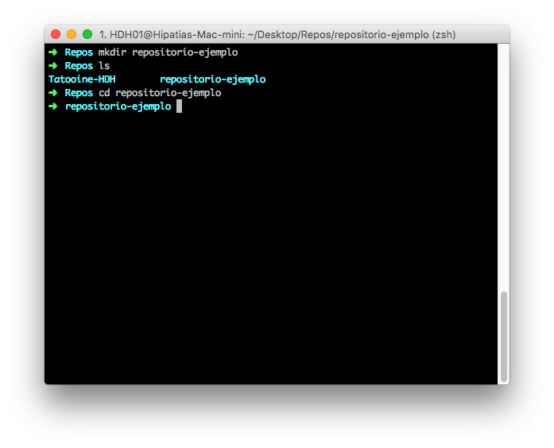
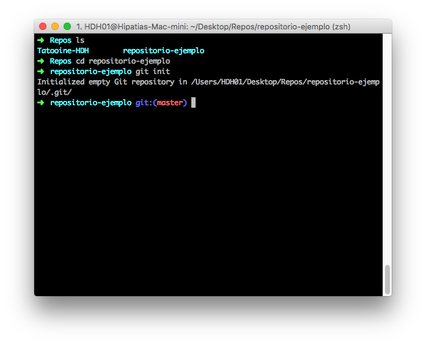

# Tutorial Básico GIT

### Creando un repositorio

Para iniciar un repositorio nuevo tenemos dos formas de hacerlo :

1. Podemos iniciar el repositorio de manera local con el comando `git init`.
2. Podemos crear el repositorio de manera remota y luego clonarlo a tu disco duro.

Ahora que ya sabemos las dos maneras para iniciar un nuevo repositorio, les mostrare los pasos a seguir.

#### iniciando repositorio de manera local

Lo primero que debemos hacer es crear un nuevo directorio, este directorio sera la raiz de tu repositorio. En este caso, ya que **GIT** es un sistema que funciona desde la consola de comandos, crearemos todo desde ahí.

- Para crear el directorio raiz en sistemas unix se ultiliza el comando `mkdir` seguido del nombre del directorio.

En la imagen de la parte superior utilizamos el comando `mkdir`(Make directory) para crear un directorio llamado *respositorio-ejemplo*, despues usamos el comando `ls`(List), para verificar que el directorio haya sido creado y seguido del comando `cd`(change directory) para situarnos en el mismo.

- Luego de situarnos en el directorio raiz de nuestro repositorio lanzamos el comando `git init` lo que inicializara un nuevo repositorio vacio de git.

#### Creando repositorio de manera remota
