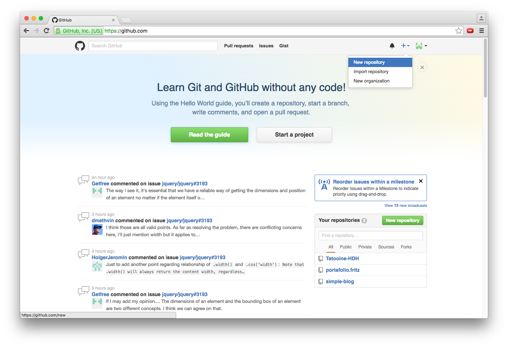
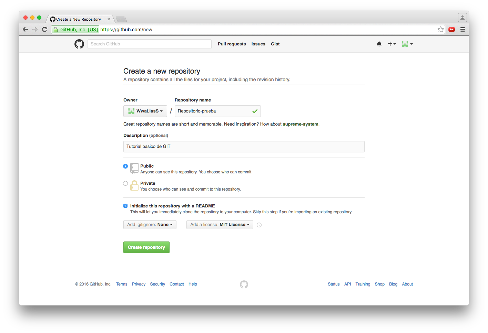
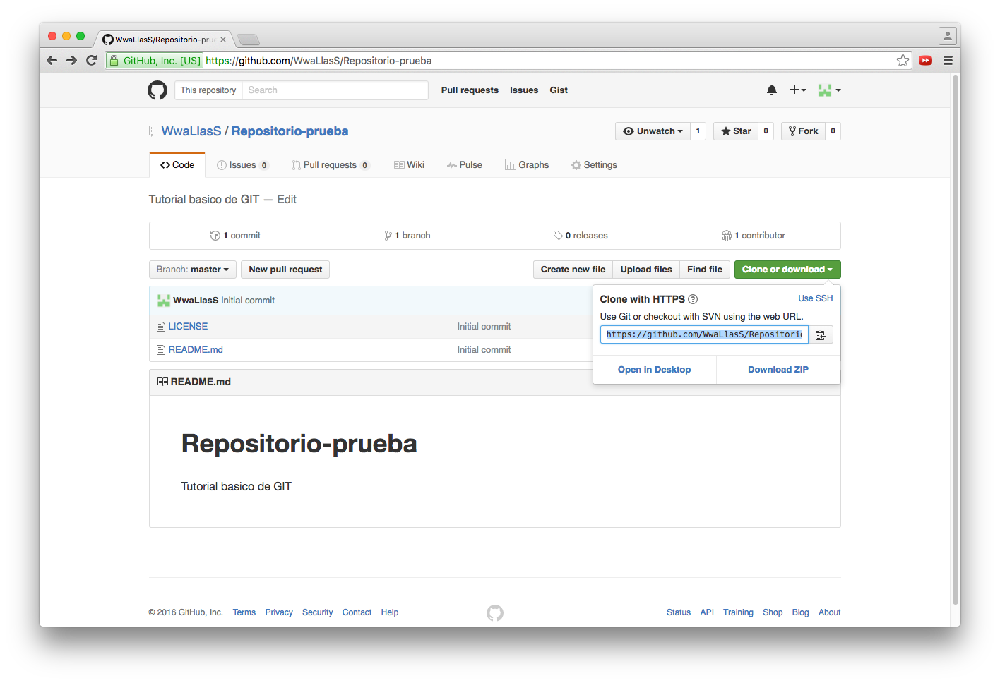
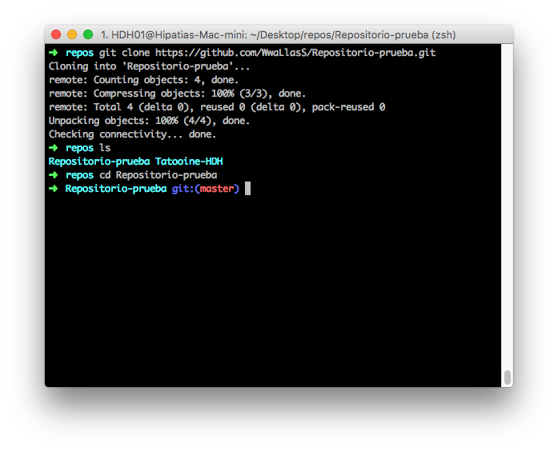

# Tutorial Básico GIT

### Creando un repositorio

Para iniciar un repositorio nuevo tenemos dos formas de hacerlo :

1. Podemos iniciar el repositorio de manera local con el comando `git init`.
2. Podemos crear el repositorio de manera remota y luego clonarlo a tu disco duro.

Ahora que ya sabemos las dos maneras para iniciar un nuevo repositorio, les mostrare los pasos a seguir.

#### iniciando repositorio de manera local

Lo primero que debemos hacer es crear un nuevo directorio, este directorio sera la raíz de tu repositorio. En este caso, ya que **GIT** es un sistema que funciona desde la consola de comandos, crearemos todo desde ahí.

- Para crear el directorio raí z en sistemas unix se ultiliza el comando `mkdir` seguido del nombre del directorio.

En la imagen de la parte superior utilizamos el comando `mkdir`(Make directory) para crear un directorio llamado *respositorio-ejemplo*, despues usamos el comando `ls`(List), para verificar que el directorio haya sido creado y seguido del comando `cd`(change directory) para situarnos en el mismo.

- Luego de situarnos en el directorio raiz de nuestro repositorio lanzamos el comando `git init` lo que inicializara un nuevo repositorio vacio de git.

#### Creando repositorio de manera remota

Para crear un repositorio remoto necesitamos tener un cuenta en alguna plataforma de desarrollo colaborativo, existen muchas de ellas sin embargo nosotros usaremos la mas popular que se llama [GitHub](https://github.com/ "ir a github.com"), luego de crearnos una cuenta gratuita procederemos a crear nuestro repositorio.

- Lo primer que debemos hacer es encontar el signo "+" ubicado en la parte superior derecha del sitio, damos click y nos desplegara un menú, luego damos click en "New repository"

- Despues de dar click en "New repository" nos mandará a la parte para poner los datos del repositorio, como primer dato podras elegir el Propietario y el nombre del repositorio, seguido de eso podras escribir una breve descripcion acerca del repositorio, despues podremos seleccionar si queremos que sera publico o privado y por ultimo nos da la opcion de iniciar con un archivo *README* y que tipo de licencia deseamos utilizar para nuestro proyecto.

- Despues de dar click en el boton "Create repository" nos redirecciona a la raíz de nuestro repositorio, entonces tenemos que ubicar un boton que dice "Clone or download", al dar click se desplegará una pequeña ventana emegente donde nos da una URL para clonarlo o la opción de descargarlo en un archivo comprimido, copiamos la URL y pasamos al siguiente paso.

- Despues de haber copiado la URL donde se encuentra alojado nuestro repositorio remoto, iremos a la consola de comandos y ejecutaremos el comando `git clone` seguido de la URL del repositorio, esto es para que git descargue el repositorio en el directorio en el cual estamos situados en ese momento, ya solo queda acceder al directorio del repositorio con el comando `cd` y listo ya tenemos nuestro repositorio local y remoto.

#### df
