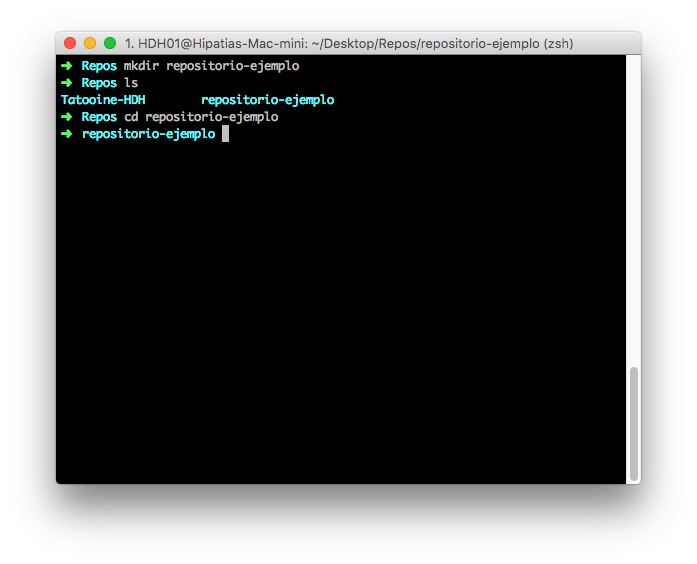
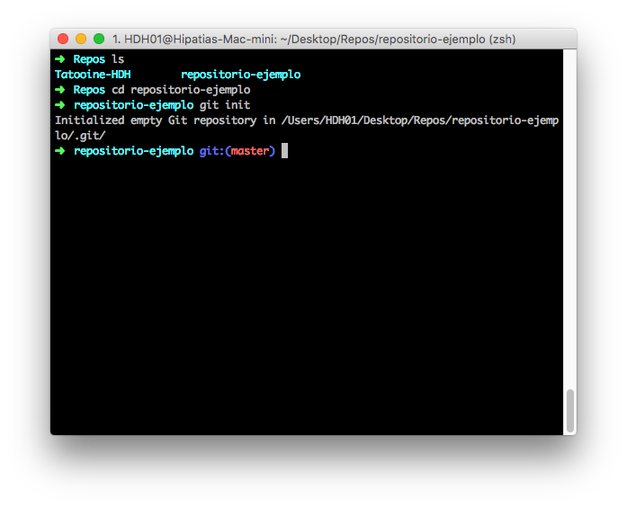
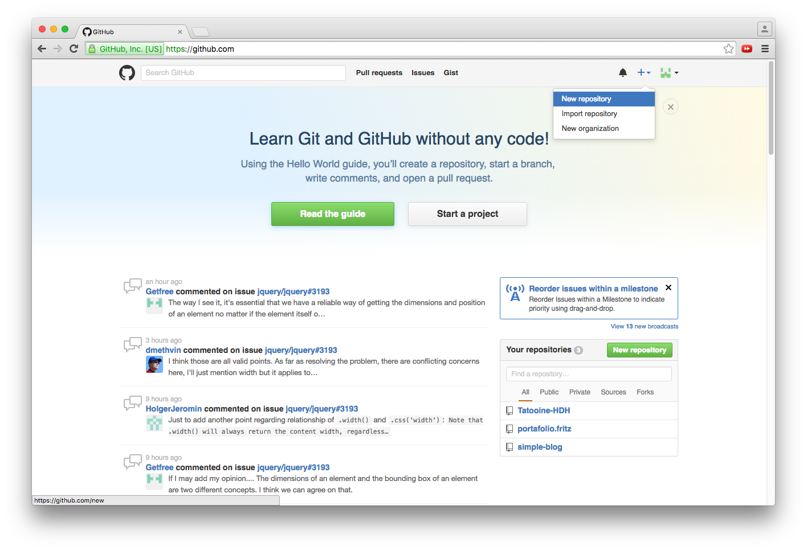
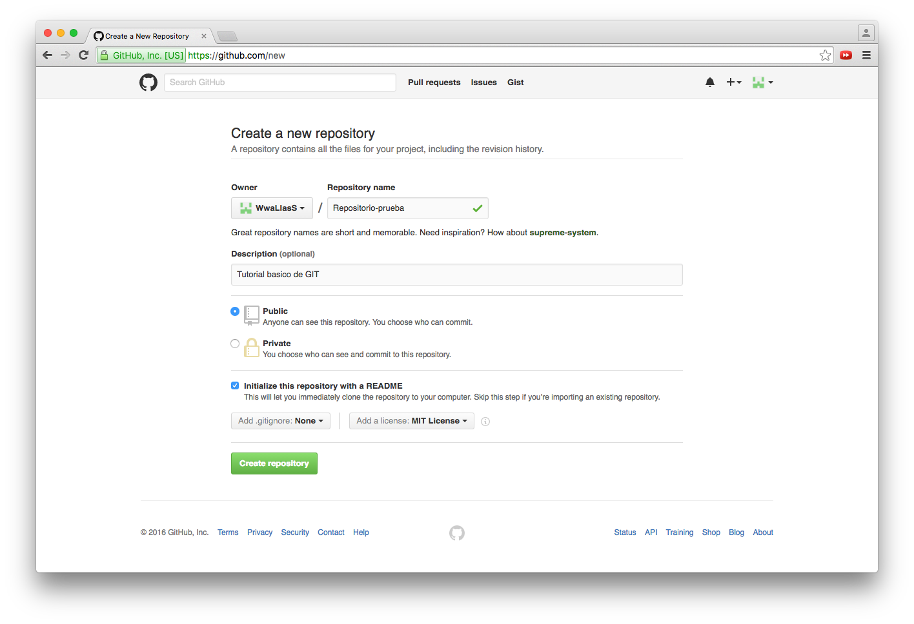
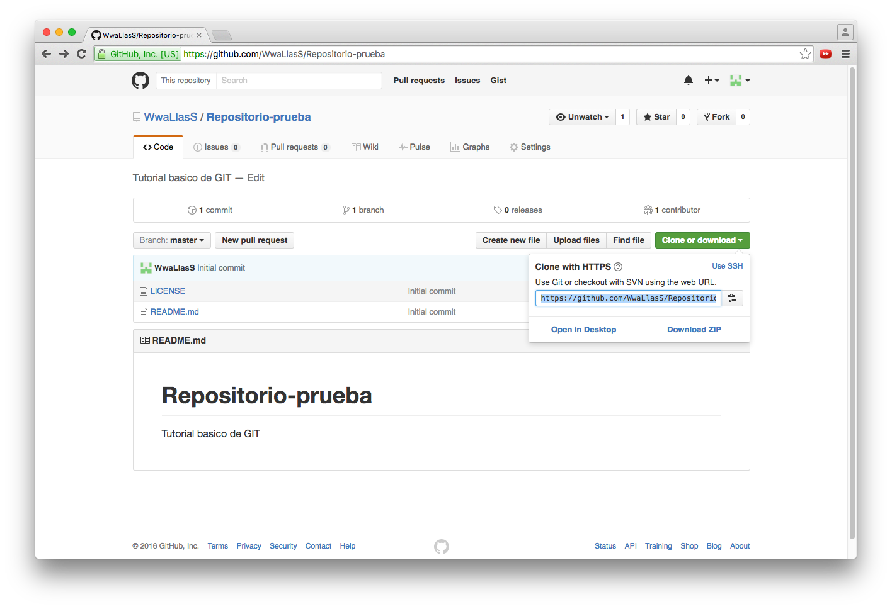
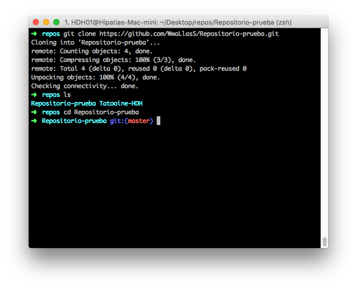

# Tutorial Básico GIT

### Creando un repositorio

Para iniciar un repositorio nuevo tenemos dos formas de hacerlo :

1. Podemos iniciar el repositorio de manera local con el comando `git init`.
2. Podemos crear el repositorio de manera remota y luego clonarlo a tu disco duro.

Ahora que ya sabemos las dos maneras para iniciar un nuevo repositorio, les mostrare los pasos a seguir.

#### iniciando repositorio de manera local

Lo primero que debemos hacer es crear un nuevo directorio, este directorio sera la raíz de tu repositorio. En este caso, ya que **GIT** es un sistema que funciona desde la consola de comandos, crearemos todo desde ahí.

- Para crear el directorio raíz en sistemas unix se ultiliza el comando `mkdir` seguido del nombre del directorio.

En la imagen de la parte superior utilizamos el comando `mkdir`(Make directory) para crear un directorio llamado *respositorio-ejemplo*, despues usamos el comando `ls`(List), para verificar que el directorio haya sido creado y seguido del comando `cd`(change directory) para situarnos en el mismo.

- Luego de situarnos en el directorio raiz de nuestro repositorio lanzamos el comando `git init` lo que inicializara un nuevo repositorio vacio de git.

#### Creando repositorio de manera remota

Para crear un repositorio remoto necesitamos tener un cuenta en alguna plataforma de desarrollo colaborativo, existen muchas de ellas sin embargo nosotros usaremos la mas popular que se llama [GitHub](https://github.com/ "ir a github.com"), luego de crearnos una cuenta gratuita procederemos a crear nuestro repositorio.

- Lo primer que debemos hacer es encontar el signo "+" ubicado en la parte superior derecha del sitio, damos click y nos desplegara un menú, luego damos click en "New repository"

- Despues de dar click en "New repository" nos mandará a la parte para poner los datos del repositorio, como primer dato podras elegir el Propietario y el nombre del repositorio, seguido de eso podras escribir una breve descripcion acerca del repositorio, despues podremos seleccionar si queremos que sera publico o privado y por ultimo nos da la opcion de iniciar con un archivo *README* y que tipo de licencia deseamos utilizar para nuestro proyecto.

- Despues de dar click en el boton "Create repository" nos redirecciona a la raíz de nuestro repositorio, entonces tenemos que ubicar un boton que dice "Clone or download", al dar click se desplegará una pequeña ventana emegente donde nos da una URL para clonarlo o la opción de descargarlo en un archivo comprimido, copiamos la URL y pasamos al siguiente paso.

- Despues de haber copiado la URL donde se encuentra alojado nuestro repositorio remoto, iremos a la consola de comandos y ejecutaremos el comando `git clone` seguido de la URL del repositorio, esto es para que git descargue el repositorio en el directorio en el cual estamos situados en ese momento, ya solo queda acceder al directorio del repositorio con el comando `cd` y listo ya tenemos nuestro repositorio local y remoto.

#### Flujo de trabajo

Una vez que tenemos nuestro repositorio clonado, revisamos el directorio con `ls` y la consola nos mostrara el archivo que contiene la descripcion de la licencia y el README.

~~~
➜  Repositorio-prueba git:(master) ls
LICENSE   README.md
~~~

Una vez verificado que esten los archivos que se crean por defecto, procedemos a revisar las Ramas(branches) escribiendo lo siguiente en la consola `git branch`.

~~~
➜  Repositorio-prueba git:(master) git branch
* master
~~~

Al ejecutar `git branch` nos mostrara una lista de las ramas existentes, en GIT por defecto tiene la rama master, en ella es donde enviaremos nuestro proyecto ya cuando se encuentre en una version estable, pero recuerda que solo debemos publicar verisiones estables en esta rama, asi que para poder trabajar crearemos una rama nueva escribiendo `git branch <nombre>` donde el nombre es el que tu quieres ponerle.

~~~
➜  Repositorio-prueba git:(master) git branch develop
~~~

Al ejecularlo nos creara una rama y si volvemos a escribir en la consola `git branch ` veremos que hora en la lista existen dos Ramas, la "master" y "develop" que es la que acabamos de crear.

~~~
➜  Repositorio-prueba git:(master) git branch
  develop
* master
~~~

Como podemos observar antecedido de la palabra **master** tiene un "\*" (asterisco), el cual nos esta indicando la rama en la que nos encontramos actualmente, pero como no queremos trabajar en esa rama escribiremos en la consola `git checkout <nombre de la rama>` y con esa pasaremos a la rama que acabamos de crear.

~~~
➜  Repositorio-prueba git:(master) git checkout develop
Switched to branch 'develop'
➜  Repositorio-prueba git:(develop) git branch
* develop
  master
~~~

Sin embargo localmente debemos trabajar en una rama temporal la cual de nombre recomendamos que sea una referencia a los cambios que se le van a realizar al proyecto, para mi caso la nombrare: *temp-branch*, asi que nuevamente haremos el poceso anterior, verificaremos que exista la nueva rama y nos situaremos en esta misma.

~~~
➜  Repositorio-prueba git:(develop) git branch
* develop
  master
  temp-branch
➜  Repositorio-prueba git:(develop) git checkout temp-branch
Switched to branch 'temp-branch'
~~~

una vez que nos situemos en la rama temporal podemos empezar a trabajar en nuestro proyecto y para que git de seguimiento del mismo en cuanto se lo indiquemos, y para esto vamos a modificar nuestro archivo *README.md* que se crea por defecto con el repositorio y agregaremos una descripción de nuestro proyecto, una vez modificado el archivo escribimos en la consola `git status` y veremos que git ahora detecto cambios en el archivo.

~~~
➜  Repositorio-prueba git:(temp-branch) git status
On branch temp-branch
Changes not staged for commit:
  (use "git add <file>..." to update what will be committed)
  (use "git checkout -- <file>..." to discard changes in working directory)

	modified:   README.md

no changes added to commit (use "git add" and/or "git commit -a")
~~~

Con esto veremos que GIT nos dice que en la rama develop existen archivos con cambios, los cuales hay que agregar para que inicie el seguimiento y quede listo para poder hacer *commit* de ellos, y esto lo hacemos escribiendo en la consola `git add <nombre de archivo>`.

~~~
➜  Repositorio-prueba git:(temp-branch) ✗ git add README.md
~~~

Ahora si volvemos a checar el "Status" podremos ver que git nos dice que el archivo ahora se encuentra en seguimiento y listo para hacer *commit*

~~~
➜  Repositorio-prueba git:(temp-branch) ✗ git status
On branch temp-branch
Changes to be committed:
  (use "git reset HEAD <file>..." to unstage)

	modified:   README.md
~~~

A continuacion debemos escribir en la consola `git commit -v` lo que nos abrira el editor de texto para que escribamos un mensaje sobre ese commit, guardamos el mensaje y cerramos nuestro editor y veremos algo como esto:

~~~
➜  Repositorio-prueba git:(temp-branch) ✗ git commit -v
[develop 7adc3ef] commit de prueba
 1 file changed, 2 insertions(+)
~~~

Ahora solo nos falta escribir en la consola `git push origin develop`, para sincronizar la informacion local, con el servidor remoto, al hacer esto te pedira tu usuario y contraseña de tu cuenta de GitHub.
