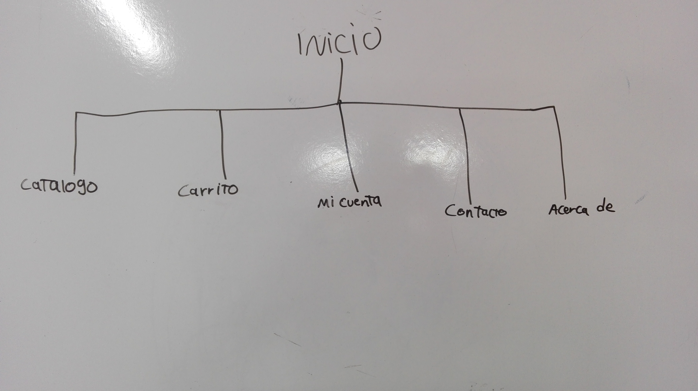
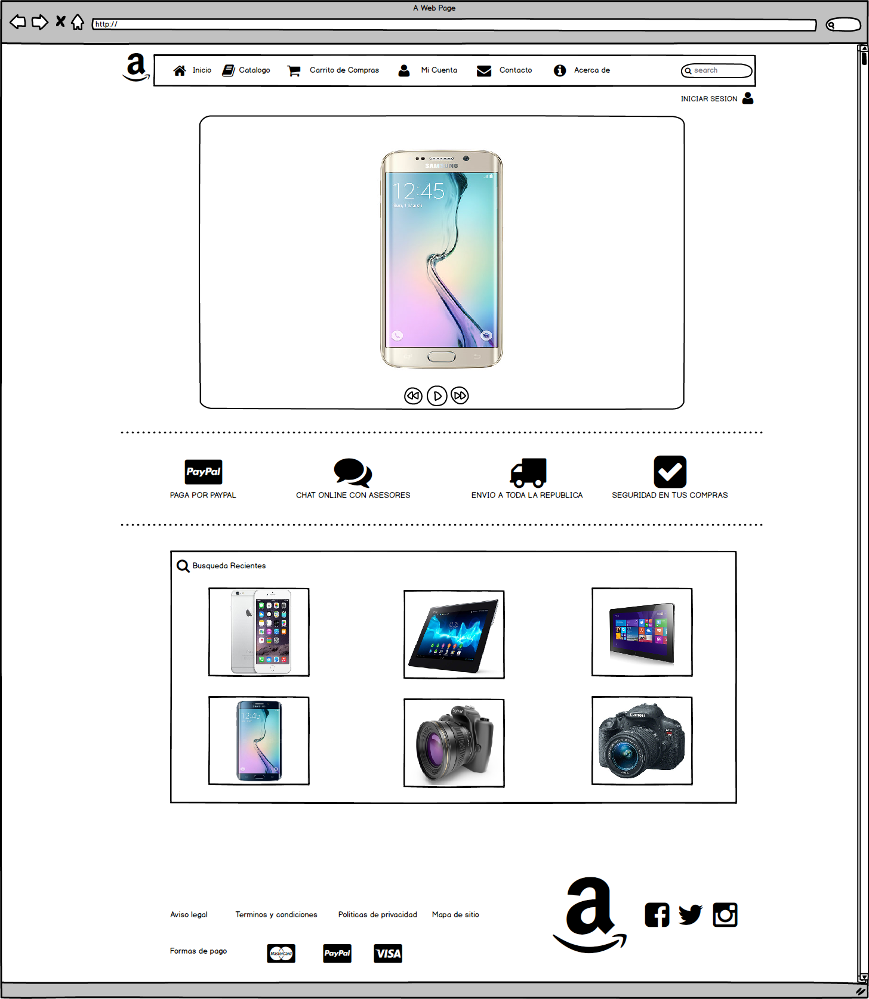
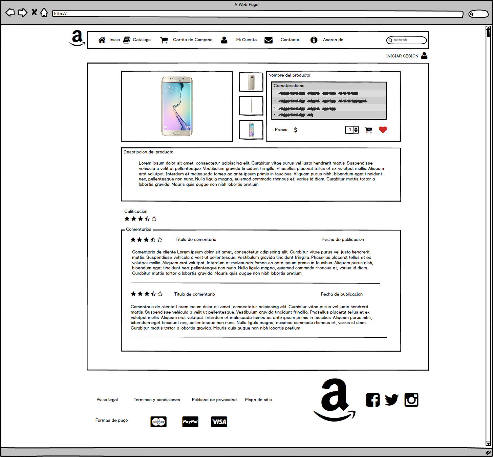

# Mapa de Sitio

## Index

Catalogo:
> La seccion de catalogo la mostramos en primer lugar, ya que al entrar al sitio los clientes, puedan ver nuestros productos en venta, asi como las categorias existentes.

Carrito:
> La seccion carrito esta en segunda posicion, por que despues de ver el catalogo y haber seleccionado el producto o los productos a comprar, se envian a una lista de compras en espera la cual es accesible desde esta seccion.

Mi cuenta:
> En esta seccion podemos registrarnos o iniciar secion, Aqui almacenamos los datos personales de los clientes, asi como datos bancarios o historial de compras. La posicion de esta seccion va a cuerdo a que puedes revisar la pagina y crear tu lista del carrito de compras sin necesidad de loguearte; Uno pasa a iniciar sesion si requiere confirmar o terminar la compra.

Contacto:

> Seccion para poder contactarse con la tienda via email o chat en linea, al igual para revisar las preguntas frecuentes de otros clientes. Al no ser una seccion que se visite muy frecuentes mente decidimos dejarla en esta posicion

Acerda de:
> Aqui tenemos la informacion basica de la tienda, asi como los terminos y condiciones y aviso de privacidad. Esta seccion es la de menos frecuencia de visitas por lo que la tenemos al final.

## Wireframing

#### Pagina de inicio

Menu principal:
>El menu principal se encuentra ubicado en el parte superior del sitio, ya que al ser una posicion comun en otros sitios web, facilita la localizacion y visibilidad.

Slider:
> Seguido del menu principal podemos ver un slider de fotos, ya que al entrar al sitio lo primero que debe ser el usuario son los productos de mayor relevancia, y con esto se pretende desarrollar el interes de los productos a los usuarios.

Garantias del servicio:
> Esta barra contiene informacion sobre las garantias del servicio el cual se brinda en el sitio web, para poyectar seguridad hacia el usuario.

Busquedas recientes:
> Esta seccion busca reflejar los productos relacionados en base a tus busquedas que has realizado recientemente.

Pie de pagina:
> Por ultimo podemos encontrar el pie de pagina (footer) del sitio web el cual cuenta con informacion sobre avisos legales, politicas de privacidad, redes sociales, los terminos y condiciones y nuevamente el logo de la pagina. Esa informacion la ubicamos ahi, ya que no es informacion relevante para el usuario.

#### Detalles Producto

Menu principal:
>El menu principal nuevamente se encuentra ubicado en la misma posicion, para proporcionar la misma visibilidad y accesibilidad de localizacion.

Seccion de producto:
> Justo despues del menu principal se ubica la seccion del producto, la cual se enfoca en mostrar una galeria de capturas del producto, asi como tambien las caractaristicas mas relevantes sobre este mismo. Tambien encontraremos las opciones para agregar el producto al carrito de compras, el precio, y un boton para marcar el producto como favorito y asi poder consultarlo mas tarde. Esta seccion esta ubicada en esa posicion ya que es la parte con mayor relevancia para el cliente, puesto que lo primero que queremos ver al visitar este tipo de sitios son mas fotos para encontrar mas interes en el producto.

Descripcion del producto:
> Esta seccion esta enfocada a dar una Descripcion completa sobre el producto, para que el cliente pueda revisar las caractaristicas completas sobre el producto el cual esta interesado. La posicion de esta seccion se dejo bajo de la seccion del producto, porque lo siguiente que regularmente solicitamos ver es una Descripcion mas extensa del producto para asi saber si es lo que realmente buscamos.

Comentarios y valoraciones:
>Esta seccion esta enfocada a dar una valoraciones al producto y ofrecer al cliente la oportunidad de darnos su opinion para que nostros podamos tomar esas opiniones como una retroalimentacion y asi poder mejorar el servicio. Por ser informacion de menor relevancia se tomo la decision de posicionarla en la parte inferior del sitio web.

